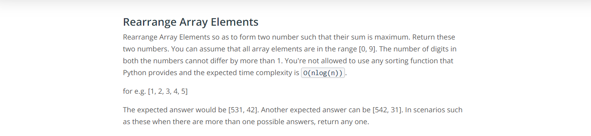
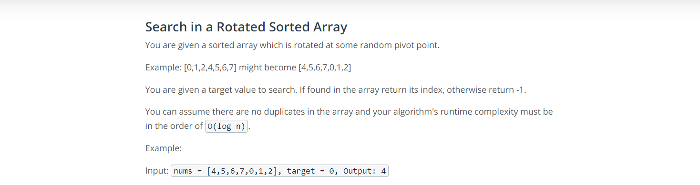
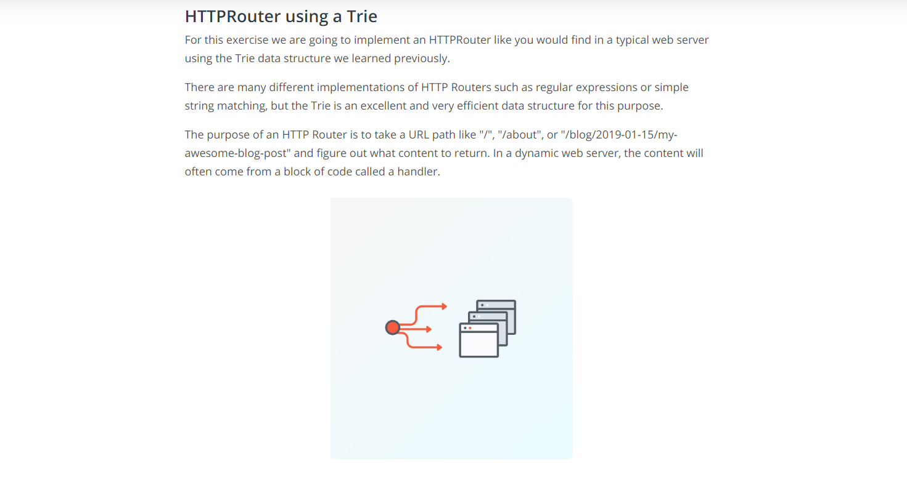
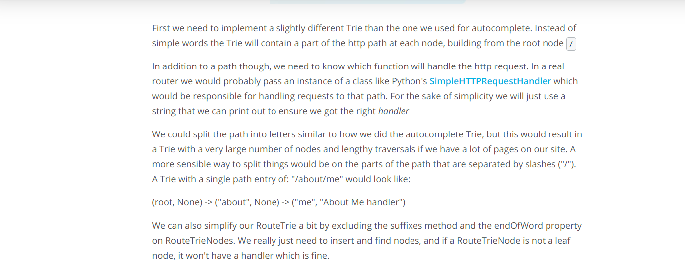
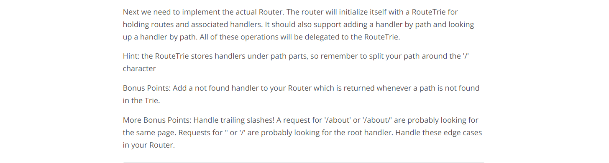
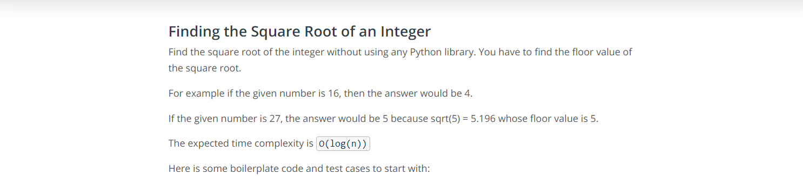

### 1. Autocomplete with Tries
---
### 2. Dutch National Flag Problem

---
### 3. Max and Min in a Unsorted Array

---
### 4. Rearrange Array Elements

---
### 5. Search in a Rotated Sorted Array

---
### 6. HTTPRouter using a Trie

---
### 7.Finding the Square Root of an Integer

